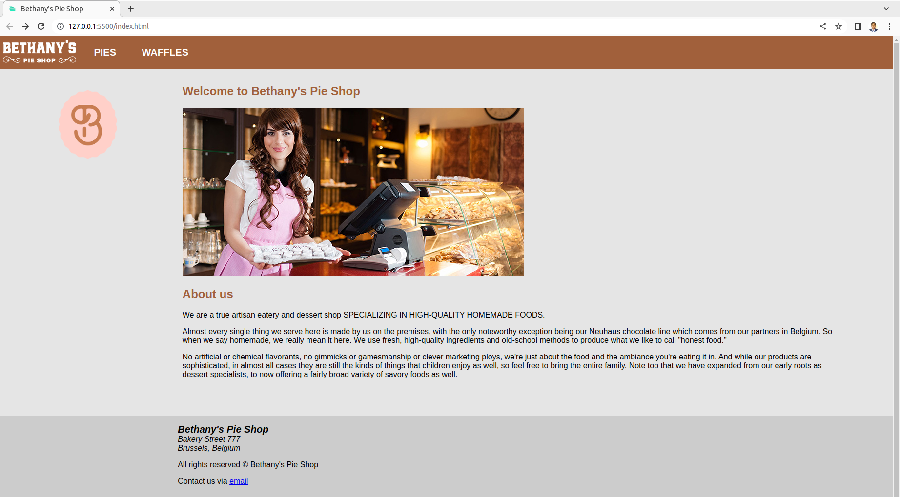
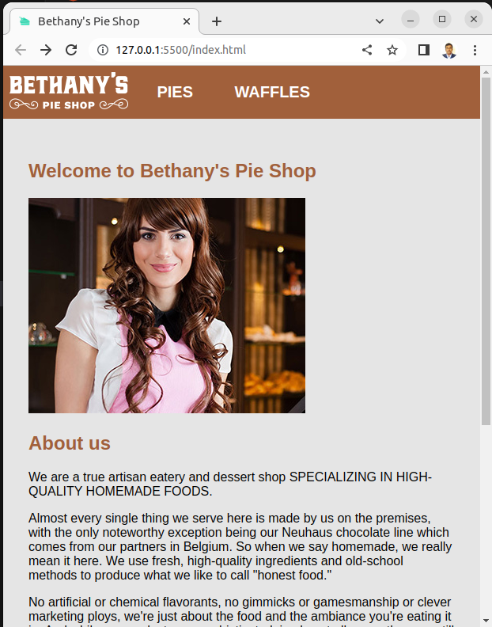

# HTML and CSS Fundamentals

* Get the VS code ready and install the `Live Server` extension.
* For html elements, refer to Mozilla Developer Network [documentation](https://developer.mozilla.org/en-US/docs/Web/HTML/Element) [2]
* Use [validator.w3.org](validator.w3.org) to check if you are following correctly the html rules
* Anatomy of a webpage:
    * `HTML`: HyperText Markup Language (HTML) is resposible for the structure of a webpage
    * `CSS`: Cascading Style Sheet (CSS) is responsible for styling of the webpage
    * `Javascript`: acts as brain responsible for the interactivity of the webpage
* A CSS class rule will win over an element rule.
* Inheritance is a powerful feature in CSS where child elements inherit the style specifics from the parent elements eliminating the need of restating the rules for child elements.
* For browser speed and maintainance purpose the style elements are specified in a separate sheet having .css extension.
* List styles are helpful for styling multiple elements at once
* You can also create and test different styles in real time using your browser directly.
* Use [caniuse.com](https://caniuse.com/) to check the browser support of css rules
which you plan to apply.

The final homepage for desktop display is as follows:

The final homepage for mobile display is as follows:

Note: One can observe that the sidebar logo disappears when we have a mobile display but shows in despktop one. 

## Reference
1. Craig Shoemaker's PluralSight course 
2. https://developer.mozilla.org/en-US/docs/Web/HTML/Element
 